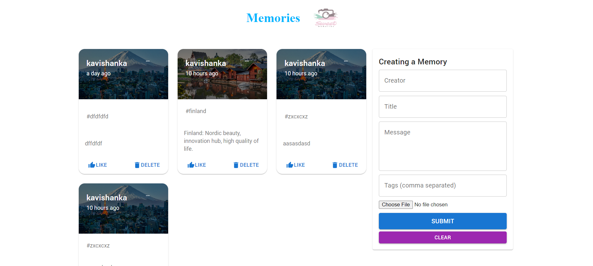

# Memeries - A Simple Social Media App

Memeries is a simple social media app built using React.js, Material-UI, and Node.js. It allows users to create, like, delete, update posts, and add tags to their posts.

## Features

- **Create Post:** Users can create new posts with text content and optional image uploads.
- **Like Post:** Users can like posts created by others.
- **Delete Post:** Users can delete their own posts.
- **Update Post:** Users can edit and update their own posts.
- **Add Tags:** Users can add tags to their posts to categorize them.
- **Responsive Design:** The app is designed to work smoothly on various screen sizes.

## Technologies Used

- Frontend: React.js and Material-UI for the user interface.
- Backend: Node.js for server-side logic.
- Database: (Mention the database technology you used, e.g., MongoDB, MySQL, etc.).

## Setup and Installation

1. Clone the repository: `https://github.com/kavishankha/mern_project_2.git`
2. Navigate to the project directory: `cd memeries`
3. Install frontend dependencies: `cd client && npm install`
4. Install backend dependencies: `cd ../server && npm install`
5. Start the frontend: `npm run start` in the `client` directory.
6. Start the backend: `npm run start` in the `server` directory.
7. Access the app at `http://localhost:3000` in your web browser.

## Project Structure

- `client`: Frontend code using React.js and Material-UI.
- `server`: Backend code using Node.js.
- `database`: Database configuration and schemas.

## Contributing

Contributions are welcome! If you find a bug or have an enhancement in mind, please open an issue or create a pull request.

## License

This project is licensed under the [MIT License](LICENSE).

## Contact

For any inquiries or suggestions, please email us at kavishankakodi12345@@email.com.

